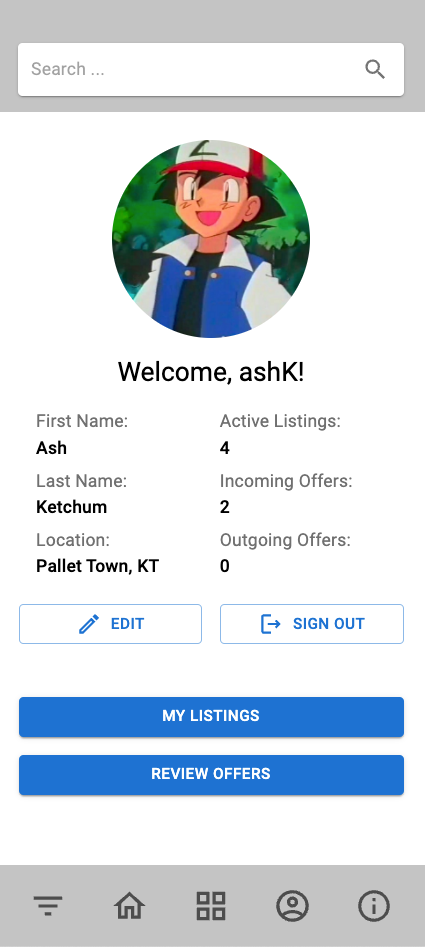
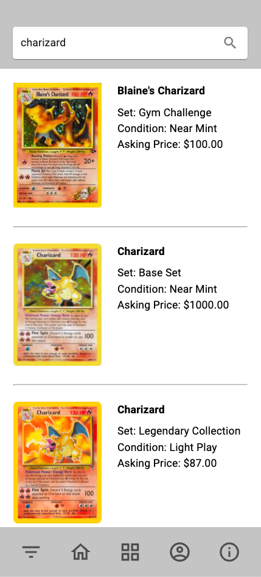
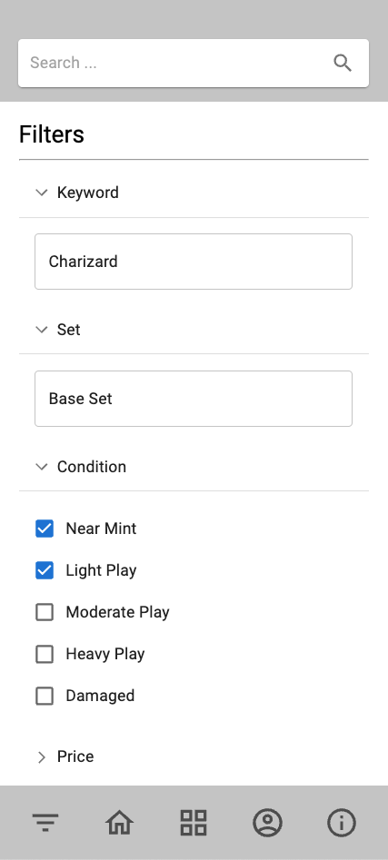
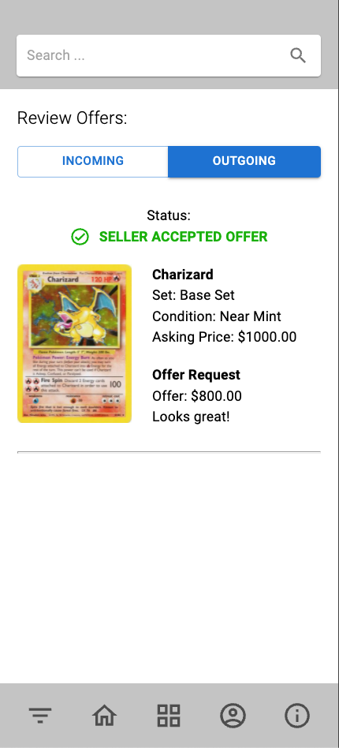

# POKÉBAY

## Description

_Duration: 3 week solo project_

Collecting like it's 1999! Pokébay brings it back the classic past time of trading pokemon cards to the 21st century, allowing the user to easily buy, sell, and trade pokemon cards with other users.

To see the fully functional mobile app, please visit: [POKÉBAY on Heroku](https://enigmatic-inlet-71376.herokuapp.com/#/filter)

## Screenshots

### Prerequisites

Link to software that is required to install the app (e.g. node).

- [Node.js](https://nodejs.org/en/)
- [React](https://reactjs.org/)
- [Redux](https://redux.js.org/)
- [PostgresSQL](https://www.postgresql.org/)
- [MaterialUI](https://mui.com/)

## Installation

1. Create a database named `prime_app`,
2. The queries in the `database.sql` file are set up to create all the necessary tables and populate the needed data to allow the application to run correctly. The project is built on [Postgres](https://www.postgresql.org/download/), so you will need to make sure to have that installed. We recommend using Postico to run those queries as that was used to create the queries, 
3. Open up your editor of choice and run an `npm install`
4. Run `npm run server` in your terminal
5. Run `npm run client` in your terminal
6. The `npm run client` command will open up a new browser tab for you!

## Usage

1. Once user registers and logs in, they are taken to the profile dashboard
    - Review and Edit Profile info
    - Review any pending incoming or outgoing offers
2. User can select 'My Listings' navigation button to their active listings 
    - clicking listing brings user to detailed view where they can also edit or delete listing
3. Home navigation will display full list of Cards available for trade or purchase
    - Search navigation at the top of the screen allows for live search
4. Filter navigation gives user advanced search options to search for exact card they're looking for

## Built With

- React JS / Redux
- Node
- Postgres SQL
- Google Material UI

## Acknowledgement
Thanks to [Prime Digital Academy](www.primeacademy.io) and the 2021 Adams cohort who equipped and helped me to make this application a reality!

## Support
If you have suggestions or issues, please email me at [brant.mccarthy@me.com](mailto:brant.mccarthy@me.com)